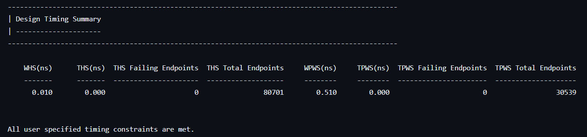
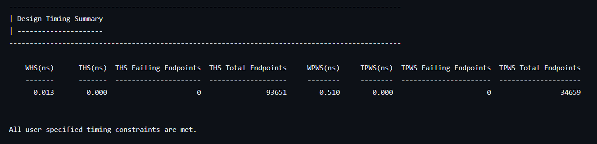

# 2023_HAPS_Finalproject_111064559
1.Introduction:
JPEG Decoder implementation through Synopsys HAPS design flow.

The source of JPEG Decoder is from [https://github.com/ultraembedded/core_jpeg]

Auto partition into two FPGA in HAPS.  

2.Block Diagram:  
  

3.Schematic:  
  
ua:  
  
ub:  
   

4.Timing Report:  
ua:  
  
  
ub:  
  
 

5.Conclusion:  
I finished the HAPS partition flow with two fpga(ua,ub) through rewriting the .tss, .pcf, .fdc to meet the JPEG decoder design without instances assignment in .pcf.
Therefore, protocompiler100 would do the partition by itself automatically.
Also, I assigned all top module IO pins on HAPS in .pcf for design verification and real implementation.
In my experience of the partion flow, HAPS is very powerful and easy to use tool to accomplish design verification or implementaion especially for very large scale design such as SOC.
Although the design I implemented is just a small decoder, I learned a lot about HAPS and its flow to help me finish the target.
It is a great practice with the course by Synopsys.
