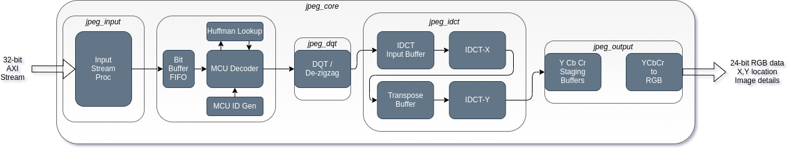
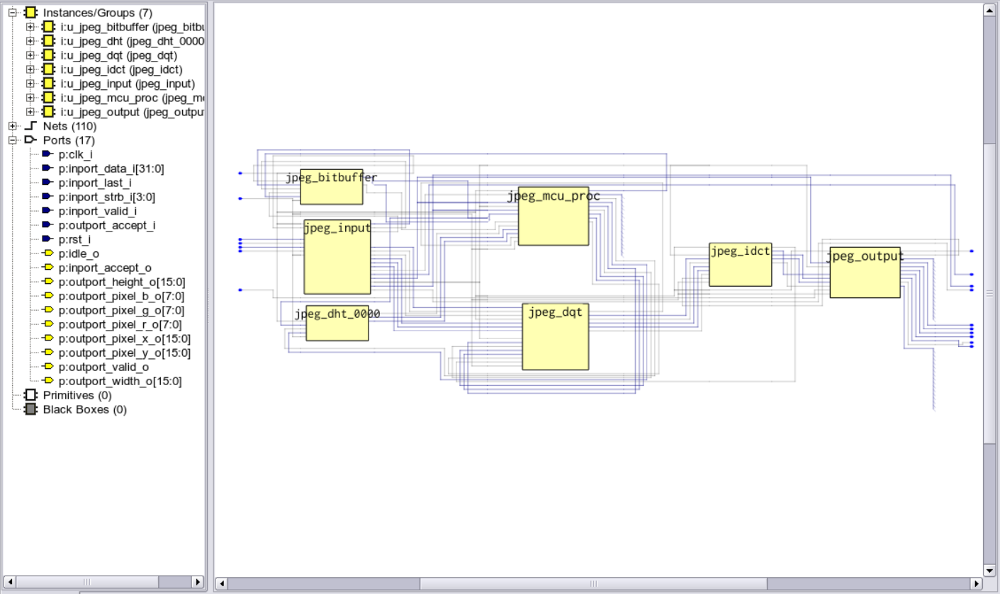
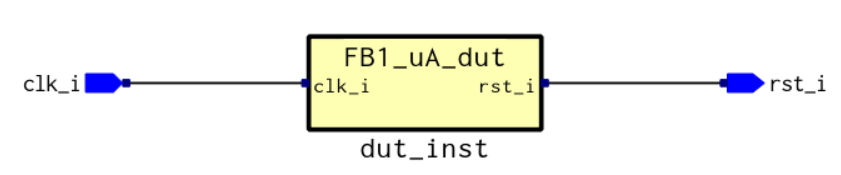
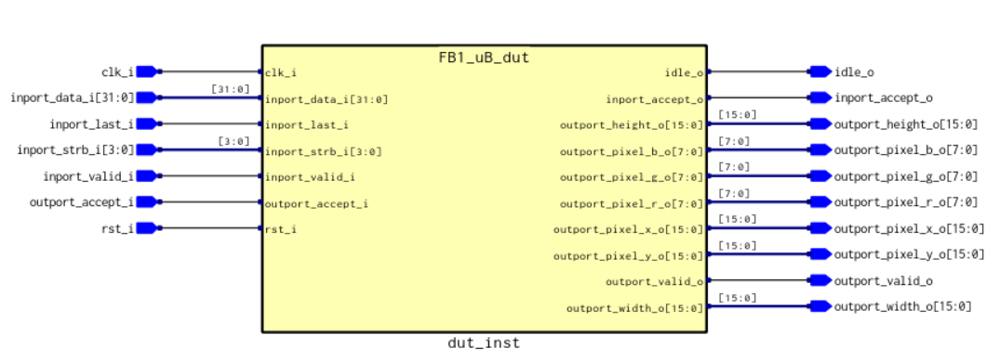
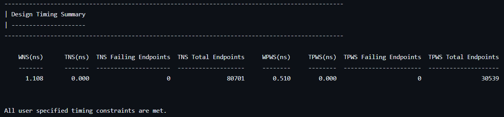
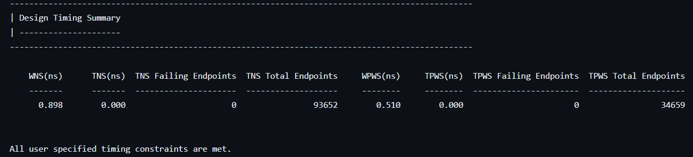

# 2023_HAPS_Finalproject_111064559
1.Introduction:
JEPG Decoder implementation through Synopsys HAPS design flow.

The source of JEPG Decoder is from [https://github.com/ultraembedded/core_jpeg]

Auto partition into two FPGA in HAPS.  

2.Block Diagram:  
  

3.Schematic:  
  
ua:  
  
ub:  
   

4.Timing Report:  
ua:  
  
ub:  
  

5.Conclusion:
